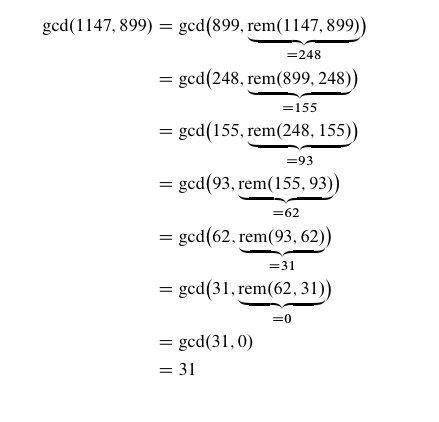

## 목차
- [정수론](#정수론)
  - [The Greatest Common Divisor (GDB)](#the-greatest-common-divisor-gdb)
    - [성질](#성질)
  - [Euclid's Algorithm](#euclids-algorithm)
  - [The Pulverizer](#the-pulverizer)
    - [Euclid's algorithm solve](#euclids-algorithm-solve)
    - [Pulverizer solve](#pulverizer-solve)
  - [Modular Arithmetic](#modular-arithmetic)
  - [RSA 암호 시스템](#rsa-암호-시스템)
    - [단계](#단계)
    - [예시](#예시)
      - [사전 준비](#사전-준비)
      - [개인키 공개키 완성](#개인키-공개키-완성)
      - ["Hello, world!" 암호화 \& 복호화](#hello-world-암호화--복호화)
  - [강의를 마무리 하며...](#강의를-마무리-하며)

---

# 정수론

정수론은 정수를 연구하는 학문이다.   

정수론 또는 수론이라고 불리우는 정수론은 실제 일상생활에 쓰이는 경우가 별로 없었지만 컴퓨터가 발전하면서 암호학에서 이 정수론을 기본으로하며 컴퓨터 공학에서 많이 사용하게 된다.   

앞으로 나오는 수들을 정수 라고 기본 전제로 깔고 가도록 하겠다!

$$
\Z \space 를 \space 알아보자!
$$

---

## The Greatest Common Divisor (GDB)   

**최대공약수**

각 정수 $a$, $b$를 나누는 가장 큰 양의 정수이다.   

$\gcd(a, b) = d$ 에서 $d$는 $d\mid a$, $d\mid b$를 만족하는 가장 큰 정수이다.   

$\gcd(a, b)$ 라고 표현할 수 있다.   

최대 공약수에는 다음과 같은 성질을 가지고 있다.   

---

### 성질

1. $a$, $b$의 모든 공약수는 $\gcd(a, b)$를 나눈다.   
2. $k > 0$ 일때, $\gcd(ka, kb) = k \cdot gcd(a, b)$ 가 성립한다.   
3. $\gcd(a, b) = 1$ 이고 $\gcd(a, c) = 1$ 이면  $\gcd(a, bc) = 1$ 이다.   
4. $a\mid bc$ 이고 $\gcd(a, b) = 1$ 이면 $a\mid c$ 이다.   
5. $\gcd(a, b) = \gcd(b, rem(a, b))$ 가 성립한다.   

---

## Euclid's Algorithm

위의 5번 성질을 이용하여 두 정수의 최대공약수를 빠르고 간단하게 구하기 위해 고안된 유클리드 알고리즘에 대해 알아보자!   

간단하게 예시를 통해 어떻게 계산이 이루어지는지 보자.   

두 정수 $1147$, $899$ 의 최대 공약수를 구해보겠다.   

   

---

## The Pulverizer

**분해기**

라고도 불리우는 이 방식은 오늘날에 있어 "**확장 유클리드 알고리즘**"으로 더 잘 알려져 있다.   

확장 유클리드 알고리즘은 베주 항등식(Bézout’s identity)을 이용하여$\gcd(a,b)$를 두 정수 $a$, $b$의 정수 선형 결합으로 표현하는 방법을 실제 계산 과정에 포함시킨 알고리즘이다.   

이해를 돕기 위해 유클리드 알고리즘과 확장 유클리드 알고리즘 이 두가지 버전으로 정수 $259$, $70$의 최대공약수 찾기를 진행해 보겠다.   

---

### Euclid's algorithm solve

$\gcd(259, 70) = \gcd(70, rem(259, 70))$   
$\qquad\qquad\qquad= \gcd(49, rem(70, 49))$   
$\qquad\qquad\qquad= \gcd(21, rem(49, 21))$   
$\qquad\qquad\qquad= \gcd(7, rem(21, 7))$   
$\qquad\qquad\qquad= 7$   

### Pulverizer solve

|$x$|$y$|$rem(x,y) = x - q \cdot y$|
|---|---|--------------------------|
|$259$|$70$|$49 = 259 - 3 \cdot 70$|
|$70$|$49$|$21 = 70 - 1 \cdot 49$|
|||$\quad = 70 - 1 \cdot ( 259 - 3 \cdot 70)$|
|||$\quad = -1 \cdot 259 + 4 \cdot 70$|
|$49$|$21$|$7 = 49 - 2 \cdot 21$|
|||$\quad = (259 - 3 \cdot 70) - 2 \cdot (-1 \cdot 259 + 4 \cdot 70)$|
|||$\quad = 3 \cdot 259 - 11 \cdot 70$|

---

$\gcd(a, b)$를 구하면서 각 나머지를 $a$와 $b$의 선형 결합으로 표현하는 방법을 기록하는 방식으로 계산한다.   
이것이 가치가 있는 이유는 우리의 목표는 최대공약수를 선형 결합으로 표현하는 것이기 때문이다.   

이 분해기 알고리즘은 항상 작동하고 종료된다는 것을 수학적 귀납법으로 증명할 수 있으며 매우 큰 수들도 빠르게 `분해`할 수 있게 된다.   
그리고 이 빠른 분해 속도는 `RSA 공개키` 시스템에서 역원을 구할 때 필수적인 도구가 된다.   

## Modular Arithmetic

$n \mid a - b$일때 $a$와 $b$가 법(modulus) $n$에 대해 합동이다.   

$$a \equiv b \pmod{n}$$

이러한 모듈러 연산은 다음과 같은 성질을 같는다.   

1. $a \equiv a \pmod{n}$   
    자기 자신과는 항상 합동이다.   
2. $a \equiv b \pmod{n}$ 이면 $b \equiv a \pmod{n}$   
    반대도 합동이다.   
3. $a \equiv b \pmod{n}$ 이고 $b \equiv c \pmod{n}$이면 $a \equiv c \pmod{n}$ 이다.   
    추이적이다.   
4. $a \equiv b \pmod{n}$이면 $a + c \equiv b + c \pmod{n}$도 합동이다.   
    더하기가 가능하다.   
5. $a \equiv b \pmod{n}$이면 $ac \equiv bc \pmod{n}$도 합동이다.   
    곱하기가 가능하다.   
6. $a \equiv b \pmod{n}$ 이고 $c \equiv d \pmod{n}$ 이면 $ac \equiv bd \pmod{n}$도 합동이다.   
    더하기 + 추이적이다.   
7. $a \equiv b \pmod{n}$ 이고 $c \equiv d \pmod{n}$ 이면 $ac \equiv bd \pmod{n}$도 합동이다.   
    곱하기 + 추이적이다.   

## RSA 암호 시스템

### 단계

- **사전준비**   
    수신자가 **공개키**, **개인키**를 다음과 같은 순서로 생성한다.   
    1. 서로다른 소수 $p,q$ 생성   
    (이 때 암호화할 메시지의 수보다는 커야 한다.)   
    2. $n = pq$ 로 정의.   
    3. $\gcd(e, \phi(n)) = 1$을 만족하는 e를 선택한다.   
    4. $d \cdot e \equiv 1 \pmod{\phi(n)}$를 만족하는 d를 구한다.   
    (이는 확장 유클리드로 쉽게 풀 수 있음.)   

- **암호화**   
    1. 메시지가 주어지면 송신자는$\gcd(m,n) = 1$인지 확인 후 공개키를 사용하여 메시지를 암호화 한다.   
$$m' = rem(m^e,n)$$

- **복호화**   
    1. 수신자는 개인키를 사용하여 암호화된 메시지 $m'$를 복호화 하여 기존의 메시지 $m$을 얻는다
$$m = rem((m')^d,n)$$

이에 대한 증명은 따로 하지 않겠다.

---

### 예시

#### 사전 준비

$p = 61, q = 53, n = 3233$   
$\phi(n) = (61 - 1)(53 - 1) = 3120$   
$e = 17, \quad (\gcd(17, 3120) = 1)$   
$d = 2753, \quad d \cdot 17 \equiv 1 \pmod{3120}$   

#### 개인키 공개키 완성

$$공개키: (e, n) = (17, 3233)$$
$$개인키: (d, n) = (2753, 3233)$$

#### "Hello, world!" 암호화 & 복호화

|문자|$m$(ASCII)|암호화 $m'=rem(m^e, n)$|복호화 $m=rem((m')^d, n)$|
|:-:|:--------:|:------------------:|:-------------------:|
| h |   104    |        2170        |         104         |
| e |   101    |        1313        |         101         |
| l |   108    |         745        |         108         |
| l |   108    |         745        |         108         |
| o |   111    |        2185        |         111         |
| , |    44    |         678        |          44         |
|(space)|  32  |        1992        |          32         |
| w |   119    |        1107        |         119         |
| o |   111    |        2185        |         111         |
| r |   114    |        2412        |         114         |
| l |   108    |         745        |         108         |
| d |   100    |        1773        |         100         |
| ! |   33     |        1853        |          33         |

하나만 계산해보자!   

$$m'= rem(104^{17}, 3233) = 2170$$
$$m = rem(2170^{2753}, 3233) = 104$$

---

## 강의를 마무리 하며...

리만 가설도 좀 정리해서 이야기해주고 싶었는데 파도파도 괴담뿐이라 여기까지만 준비했습니다.   

조금만 풀어서 이야기하자면 소수의 분포가 복소평면 위의 일직선상에 모두 일치해 있다는 건데 이게 뭐 양자역학과도 연관이 있다 동떨어진 물리학과 수학이 이 공식을 통해 만나게 되었다 평생을 리만가설 풀다가 조현병 앓은 수학자, 어느 수학자는 먼 미래에에 깨어나면 처음으로 할 질문으로 리만가설 풀렸나고 물어본다고 하고 너무 어려워서 더는 파지 않기로했습니다.    

이 문제 풀면 클레이 연구소에서 백만달러 준다는데 이게 인생역전의 기회가 아닐까요?    